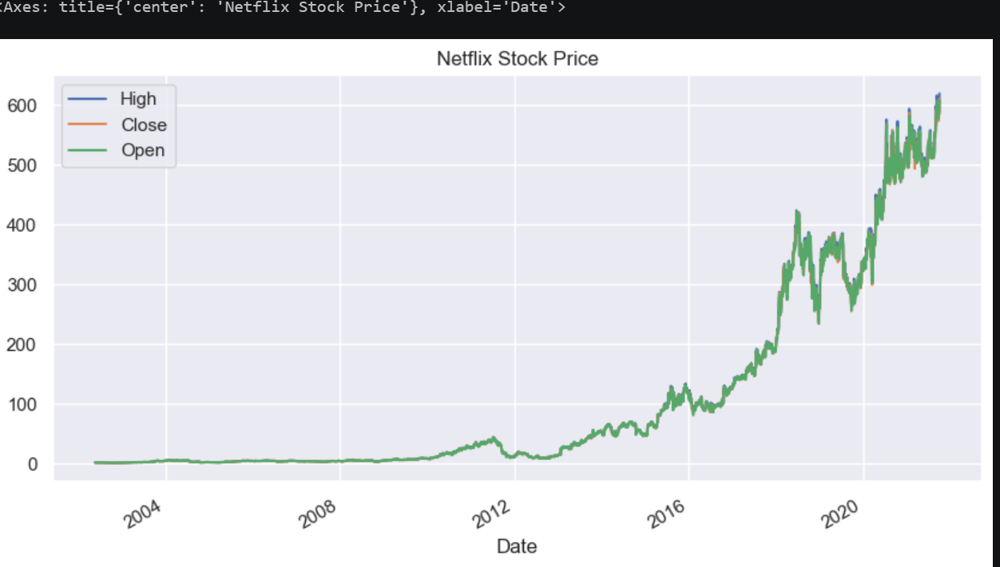
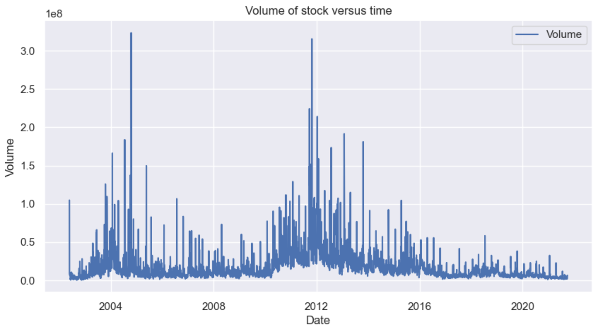
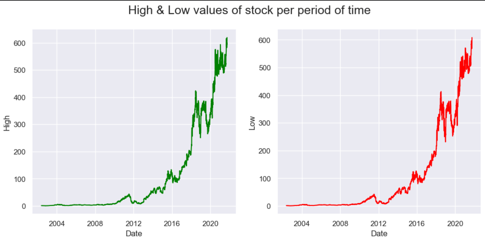

📈 DMart Stock Market Analysis

🚀 Project Overview

This project focuses on analyzing DMart (Avenue Supermarts) stock market data using Python and data visualization techniques. The objective is to explore historical stock performance, identify trends, and generate meaningful insights through Exploratory Data Analysis (EDA).

---

🎯 Objectives

✅ Analyze historical stock prices

✅ Study market trends and patterns

✅ Examine trading volume behavior

✅ Perform Exploratory Data Analysis (EDA)

✅ Create insightful visualizations

---

🛠️ Technologies Used

- Python
- Jupyter Notebook
- Pandas
- NumPy
- Matplotlib
- Seaborn

---

📂 Dataset Information

The dataset contains historical stock market information, including:

- 📅 Date
- 📈 Open Price
- 📉 High Price
- 📉 Low Price
- 💰 Close Price
- 💵 Adjusted Close Price
- 🔄 Trading Volume

---

📁 Project Structure

Demart-Stock-Market-Analysis/
|
├── Demart_stock_analysis.ipynb
├── demart_stock_data.csv
├── requirements.txt
├── README.md

---

🔍 Analysis Performed

📊 Data Cleaning & Preprocessing

- Handling missing values
- Data formatting
- Data inspection

📈 Exploratory Data Analysis

- Historical price trend analysis
- Volume analysis
- Statistical summaries

📉 Data Visualization

- Stock Price Trends
- Trading Volume Analysis
- Market Performance Insights

---

🖼️ Project Visualizations

📈 Stock Price Trend

📊 Trading Volume Analysis

📉 Market Insights

---

⚙️ Installation

Clone the Repository

git clone https://github.com/Riturajkalkhudiya/Demart-Stock-Market-Analysis.git

Install Required Libraries

pip install -r requirements.txt

Run the Notebook

jupyter notebook

---

📌 Key Insights

✨ Identified historical stock price trends

✨ Analyzed market movement patterns

✨ Visualized trading volume behavior

✨ Derived meaningful insights through EDA

---

👨‍💻 Author

Rituraj Kalkhudiya

🎓 B.Tech Computer Science Engineering

📊 Aspiring Data Analyst

💡 Passionate about Data Analytics, Business Intelligence, and Visualization

---

⭐ Support

If you found this project useful, consider giving it a ⭐ on GitHub!

🔗 Repository Link

https://github.com/Riturajkalkhudiya/Demart-Stock-Market-Analysis

